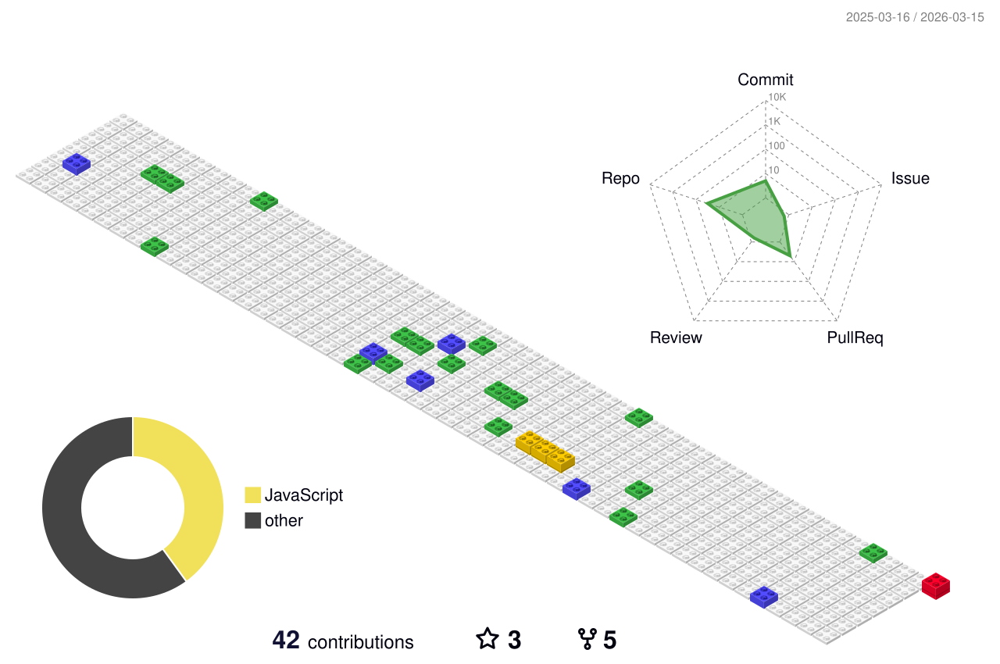

<h1 align="center">Bruna Lopez Pinheiro</h1>

  Estudante de TI · Desenvolvedora em Formação

---

---

## Sobre

- Estudante de **Análise e Desenvolvimento de Sistemas**
- Focada em **desenvolvimento backend**
- Estudando **C#, .NET e PostgreSQL**
- Experiência com **JavaScript, Node.js, Express, Sequelize, SQL, HTML, CSS, Tailwind CSS e React**
- Conhecimentos em **Programação Orientada a Objetos, Estrutura de Dados e Modelagem de Banco de Dados**
- Interesse em **desenvolvimento de APIs, backend e boas práticas de código**

---

## Tecnologias e Estudos

- **Backend:** C#, .NET, Node.js  
- **Banco de Dados:** PostgreSQL, SQL  
- **Frontend:** HTML, CSS, JavaScript, React, Tailwind CSS  
- **Ferramentas:** Git, GitHub, Figma  

---

## Projetos em destaque

- **TEIA** – Desenvolvimento de telas e componentes utilizando React e organização de rotas  
- **Sistema MEI** – Página de login interativa com manipulação de DOM e comportamento visual dinâmico  

---

## Contato

- LinkedIn: https://www.linkedin.com/in/bruna-lopez/
- GitHub: https://github.com/brunalopez11
- E-mail: brunalopez.421@gmail.com

---

> Evolução constante através da prática, disciplina e aprendizado contínuo.
